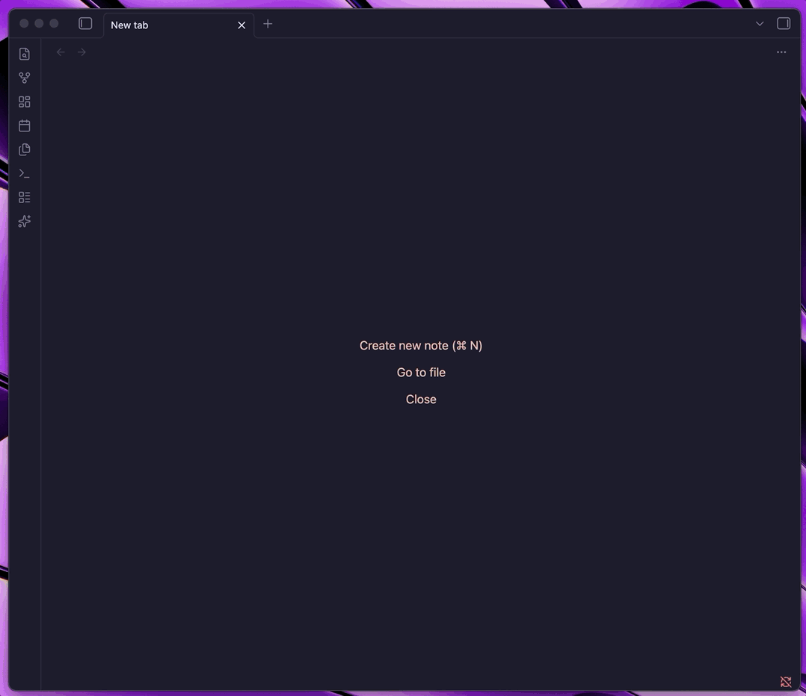
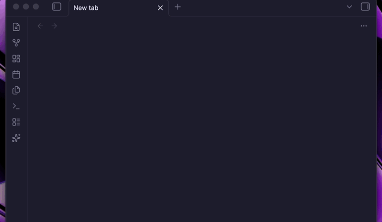

# Changelog

What's new and changed in each Seam release.

## [3.0.0] - 2026-10-02
<!-- iterations: iteration_08..iteration_10 -->

### Added

- **Special Search and custom queries**: Save and pin searches using the Seam search system or an Obsidian Base. Choose which built-in searches appear and reorder them.
- **Obsidian Bases**: Browse Base views directly in the Universal Palette, including on mobile.
- **Combined search**: Search notes and files by name, path, or extension; combine text, tags, saved searches, and `/` folder filters. Results show matching passages and match counts.

- **Special searches**: Find recent files, notes from a date range, today's or yesterday's Daily Note, and tasks. `@todo` results can show task completion percentages.
- **Quick note command**: Create and open a note instantly using the configured Fleeting folder and template.

- **Source notes**: Automatically create linked notes for supported documents and images in a chosen folder with your template, or create them from an attachment in the Universal Palette. Find them with `@sources`; embedded PDFs display as continuous pages. Existing files are included when source automation is enabled or the folder changes.

### Changed

- Seam now requires Obsidian **1.13.0** or newer.
- Open search results in a vertical split with `Shift + Enter`.

## [2.0.1] - 2026-09-23

### Changed

- Release screenshots now display in Seam's update window.

## [2.0.0] - 2026-09-23
<!-- iterations: iteration_06..iteration_07 -->

### Added

- **Quick Capture**: Create capture shortcuts with your preferred templates and folders.

- **Special searches**: Find documents, images, tasks, code, and untagged notes. Search exact phrases with double quotes.

- **Exclude tags**: Use `!#tag` to leave matching notes out of your search.

- **Recent Files**: Browse your ten most recently modified notes.

- **Release updates**: Choose when to receive update notices and read release notes in settings.

### Changed

- **Universal Palette**: Clearer search hints and command navigation.
- **Quick Capture settings**: Filter, reorder, duplicate, and customize your capture choices.

## [1.0.4] - 2026-09-15

### Changed

- Clearer English and Brazilian Portuguese guides for getting started and using Seam.

## [1.0.3] - 2026-09-14

### Added

- **Automation timing**: Organize notes when switching notes or after a short delay.
- **Shortcut settings**: See your Palette shortcut and customize it through Obsidian's Hotkeys settings.
- **Visual walkthrough**: Preview Seam's organization and search features in the documentation.
- **Project support**: New sponsorship options.

### Changed

- Seam is now licensed under the GNU General Public License v3.0.

## [1.0.2] - 2026-09-13

### Changed

- Choose your Palette shortcut in Obsidian's Hotkeys settings; no shortcut is assigned by default.
- Improved native settings appearance and support for pop-out windows.

## [1.0.1] - 2026-09-13

### Changed

- Updated Seam's plugin listing information.

## [1.0.0] - 2026-09-13
<!-- iterations: iteration_00..iteration_05 -->

Initial public release of **Seam**.

### Added

- **Automatic organization**: Move notes with `#permanent` and `#archive` on desktop and mobile.
- **Move cleanup**: Remove temporary tags and properties as notes are organized.
- **Universal Palette**: Search titles, note content, and tags from one place.
- **Fleeting notes**: Create notes instantly with an optional template.
- **Palette actions**: Open results in new tabs and run Seam commands.
- **Organization commands**: Archive notes, move them to Permanent, and process pending automations.
- **Personalization**: Customize folders, shortcuts, and search icons.
- **Languages**: English and Brazilian Portuguese.
