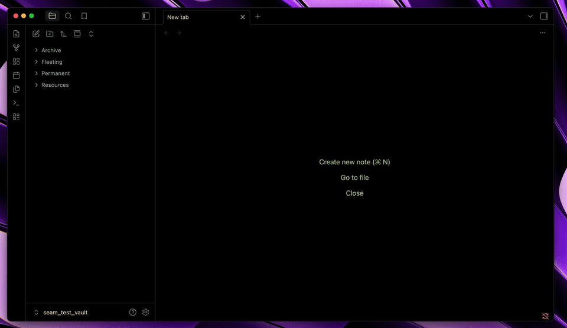
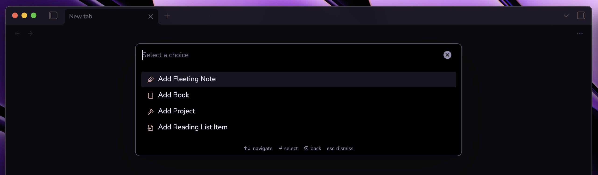
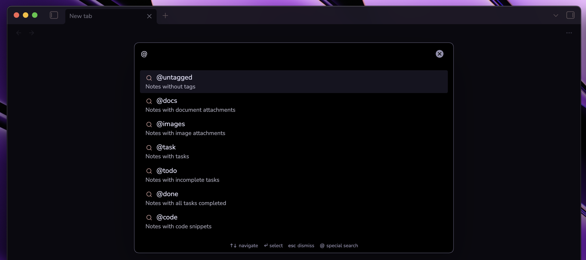
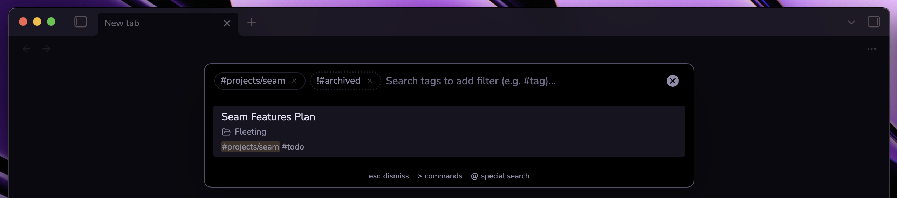
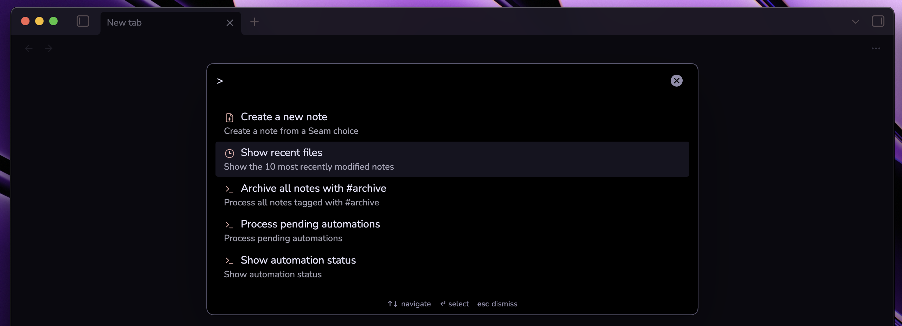

# Changelog

All notable changes to Seam are documented in this file.

The format is based on [Keep a Changelog](https://keepachangelog.com/en/1.1.0/),
and this project adheres to [Semantic Versioning](https://semver.org/spec/v2.0.0.html).

## [3.1.0] - 2026-10-01
<!-- iterations: iteration_09 -->

### Added
- **Note match navigation**: Opening a searched note selects and scrolls to its first content match; normal editor interaction clears the selection.
- **Result metadata**: Note results show their extension and content match count.
- **Directory filtering**: `dir:` works with tags in Palette and saved Seam-tag searches, with vault folder suggestions including paths with spaces.
- **All-file search**: Plain text and directory searches include attachments and other vault files by filename, path, and extension.
- **Split navigation**: Shift+Enter and Shift+Mod+Enter open a selected result in a vertical split.
- **Quick note command**: Create a UUID-named note from the configured Fleeting template in the configured folder, with root fallback, collision checks, and automatic opening.
- **Composable special searches**: Combine built-in and saved Seam-mode queries by intersection, then narrow their results with additional tag or directory filters. Base-mode searches remain standalone.

### Changed
- **Placeholder audit**: Shorten Palette and Quick Add prompts, correct the Seam search grammar, show the `>` command prefix, and align English and Portuguese wording. Settings placeholders with short path examples and filter labels remain concise.
- **Placeholder copy and visibility**: Shorten general, tag, and Base view placeholders; use the requested file-and-tag hint for Seam special searches with a visible gap after the query, and hide it for Base searches.
- **Search results**: Commands appear only for an empty Palette input or in `>` mode.
- **Palette guidance**: Active searches show quoted symbolic shortcuts for opening results, plus a `dir:` folder hint outside Base mode.
- **Directory and custom-query UI**: Selected folders use the accent color and one-step Backspace deletion; special queries insert a trailing space; the custom search mode reads “Seam search system” and folder suggestions have icon spacing.
- **Palette guidance and search filter labels**: Empty and active helper rows use their requested order, the active-search shortcut symbols have no quotes, `dir:` appears as a helper only when input is empty, and the placeholder documents all supported search prefixes. The custom search field is labeled “Seam filter.”
- **Composed-search tag chips**: Tags selected alongside special searches use the standard removable Seam chips, including excluded-tag styling. Chip removal preserves the special query and updates its filters.

### Fixed
- **Active filter placeholders**:
  - **Root Cause**: The selected special query occupied the input, hiding its native placeholder until a tag converted it to a separate prefix.
  - **Fix**: Display the tag guidance next to the mirrored special token and use consistent placeholder copy for special, tag, and directory filters.
  - **Verified Scenarios**: Live empty Palette, special-query selection from suggestions, composed tag selection, and ordinary tag selection.
- **Search footer and folder prompt**:
  - **Root Cause**: Special-search and tag-search footers omitted opening shortcuts, and the populated `dir:` input hid its native placeholder.
  - **Fix**: Show the requested ordered shortcuts, route Base Shift+Enter to a split, and display tag guidance beside the selected folder token.
  - **Verified Scenarios**: Live footer checks for Seam, Base, and tag queries; live `dir:Fleeting` placeholder inspection.
- **Caret after composed chips**:
  - **Root Cause**: The special query remained in the editable input before the trailing chips, placing the caret before selected tags.
  - **Fix**: Render the committed special query and tag chips before a separate editable input, while including the committed query in filtering.
  - **Verified Scenarios**: Live caret-position checks after one and two composed chips, excluded-tag selection, Backspace removal, and ordinary tag selection/removal.
- **Composed-filter order**:
  - **Root Cause**: All selected tags used the leading chip container, placing composed tags before the special query.
  - **Fix**: Place tags selected after a special query in a trailing chip container, preserving selection order and retaining the leading container for ordinary tag searches.
  - **Verified Scenarios**: Live position checks for `@fleetingNotes #ai` and ordinary `#books` selection, plus chip removal and default Backspace deletion.
- **Special-search tag completion**:
  - **Root Cause**: Special-search execution took priority over tag suggestions, and selecting a tag cleared the active special query.
  - **Fix**: Reuse Palette tag suggestions inside compatible special searches, retain selected tags inline, and remove completed tag tokens with one Backspace.
  - **Verified Scenarios**: Live completion, selection, and whole-token deletion for `@fleetingNotes #books`, excluded tags, and built-in `@todo` searches.
- **Mobile Base viewport**:
  - **Root Cause**: The Markdown embed paragraph and Base view expanded beyond the Palette's clipped mobile result area.
  - **Fix**: Size the embed wrapper and Base view to the available viewport and route keyboard navigation to the actual scrolling element.
  - **Verified Scenarios**: Mobile emulation of `@bookshelf` shows the viewport with the final row reachable by scrolling.

## [3.0.0] - 2026-09-23
<!-- iterations: iteration_08 -->

### Added

- **Custom special searches**: Create reusable `@` queries from Seam tags or Obsidian Base files, with a configurable `search` icon by default plus pinning, hiding, and ordering controls.
- **Base results in the Universal Palette**: Render configured Base views as selectable Seam results with arrow-key navigation, Enter-to-open, live filtering, and matching-text highlights.

<!-- Screenshot suggestion: show a Base-backed custom search in the Universal Palette, including filtered results and the keyboard navigation hint. -->

- **Built-in special-search controls**: Pin, hide, and reorder built-in queries; show each `@todo` note's completion percentage by default, with a localized label.
- **Recent and date-based queries**: Use `@recent` for the ten most recently modified files, `@lastXdays` for a chosen date range, and `@today` or `@yesterday` for Daily Notes.
- **Universal Palette ribbon options**: Choose to show the command on desktop and mobile, on mobile only, or hide it.
- **Create-note hotkey command**: Assign a custom Obsidian shortcut to “Seam: Create a new note”.
- **Command visibility setting**: Show Seam commands by default or keep them behind the `>` prefix.

### Changed

- **Obsidian compatibility**: Requires Obsidian 1.13.0 or newer.
- **Settings search**: Migrated Seam's settings to Obsidian's declarative settings API so users can find them through Settings search.
- **Locale detection**: Uses Obsidian's runtime locale APIs without browser storage access.
- **Special-search interaction**: Keep input text in Obsidian's normal color, accent only the active `@query` token, and remove an active query with one Backspace press.
- **Recent files**: Replaced the former “Show recent files” command and palette subview with the `@recent` special query.

### Removed

- **`@ocr` special search**: Removed temporarily.

### Fixed

- **Negated tag chips**: Keep an excluded tag visible when it is the first or only tag in the active filter.
- **Base result navigation and filtering**: Keep cards visible when navigating down and back up, search the full Base result set, and visit every result with Up/Down while Left/Right move the query caret.
- **Contextual command order**: Show Archive and Move to Permanent immediately after Create a new note when available.
- **Special-search input hover**: Keep the active query and typed filter text visible while hovering over the input.

## [2.0.1] - 2026-09-23

### Fixed

- **Release note images**: Resolve repository-relative images from GitHub so screenshots display correctly inside Seam's update modal.

## [2.0.0] - 2026-09-23
<!-- iterations: iteration_06..iteration_07 -->

### Added

- **Quick Add workflows**: Create notes from configurable choices with templates, folders, opening behavior, focus, icons, draft persistence, and collision handling.

- **Advanced Universal Palette search**: Search exact phrases with double quotes and filter notes with `@untagged`, `@docs`, `@images`, `@task`, `@todo`, `@done`, and `@code`.

- **Negated tag search**: Prefix a tag with `!` to exclude matching notes, such as `#projects !#archived`.

- **Recent Files**: Browse the ten most recently modified Markdown notes from the Universal Palette.

- **Release updates**: Choose when Seam announces updates and read the release notes for the currently installed version from the Updates settings.

### Changed

- **Universal Palette**: Added contextual helper text, cleaner command navigation, tag filtering guidance, and Backspace navigation for secondary views.
- **Quick Add settings**: Added choice filtering, reordering, duplication, deletion, path suggestions, and native icon previews.

### Fixed

- **Quick Add creation**: Fixed template and path persistence, Enter submission, collision safety, numbered new-note titles, and palette dismissal after successful creation.

## [1.0.4] - 2026-09-15

### Changed

- Simplified the English and Brazilian Portuguese documentation for clearer onboarding, workflows, feature descriptions, settings, and commands.

### Fixed

- Removed a settings refresh call introduced after Seam's declared minimum Obsidian version while preserving automatic conditional-setting updates.
- Removed redundant TypeScript assertions reported by Obsidian's source analysis.

## [1.0.3] - 2026-09-14

### Added

- **Configurable Automation Delay**:
  - Added an **Automation Delay** setting allowing users to configure note organization timing:
    - **When switching notes** (default): Keeps notes undisturbed while writing or reading, and quietly moves them in the background as soon as you switch to another note or leaf.
    - **Timed delays** (1s, 2s, 5s): Debounced delays that also trigger immediately upon note switch for seamless transitions.
- **Universal Palette Hotkey Display**:
  - Added a shortcut badge in plugin settings displaying the current hotkey assigned to the Universal Palette (e.g. `⌘ K` on macOS, `Ctrl + K` on Windows/Linux) with a direct link to Obsidian's native Hotkeys manager to customize it without conflicts.
- **Showcase & Visual Walkthrough**:
  - Added an interactive visual preview in documentation showcasing note organization and Universal Palette capabilities.
- **Project Sponsorship**:
  - Added GitHub Sponsors and Buy Me a Coffee funding options (`FUNDING.yml`).

### Changed

- Updated project license to GNU General Public License v3.0 (GPL-3.0-or-later).

## [1.0.2] - 2026-09-13

### Changed

- Replaced HTML heading elements in settings tab with native `Setting.setHeading()` API.
- Migrated operating system detection to Obsidian's native `Platform.isMacOS` API.
- Replaced inline style assignments with CSS classes for palette tag chips.
- Removed default command hotkey to avoid conflicts with user hotkeys per Obsidian review guidelines.
- Replaced third-party `builtin-modules` package with native Node.js built-in module resolution.

### Fixed

- Added popout window compatibility using `window.setTimeout` and `window.clearTimeout`.
- Handled un-awaited promises and tightened TypeScript strictness across automation and UI services.
- Removed unused Notice import in `AutomationService`.

## [1.0.1] - 2026-09-13

### Changed

- Updated plugin manifest metadata per Obsidian review requirements.

## [1.0.0] - 2026-09-13
<!-- iterations: iteration_00..iteration_05 -->

Initial public release of **Seam** — Frictionless note organization and Universal Palette for Obsidian.

### Added

- **Core Automation Engine**:
  - Event-driven background queue with 750ms debounce and serialization to prevent concurrent mutations.
  - Startup and periodic vault reconciliation (default 15 minutes) to ensure no action tags are missed.
  - 100% native Obsidian APIs with zero desktop-only dependencies (`isDesktopOnly: false`), fully compatible with macOS, Windows, Linux, iOS, iPadOS, and Android.
- **Tag-Driven Note Organization**:
  - `#permanent`: Moves notes to the designated `Permanent/` folder and strips the action tag.
  - `#archive`: Moves notes to the designated `Archive/` folder, strips `#archive`, and adds the durable `#archived` state tag.
  - Conflict prevention: Notes containing both `#archive` and `#permanent` are left untouched and flagged as a conflict.
  - Overwrite protection: Moving notes checks for destination filename collisions without overwriting existing files.
  - Safe ordering: Notes are relocated before tags or properties are modified, ensuring operations are recoverable if interrupted.
- **Post-Move Cleanup ("Moving Notes Behavior")**:
  - Automatically strips temporary scratch tags (e.g., `#todo`, `#permanent`) and frontmatter properties (e.g., `status`) when moving notes to `Permanent/` or `Archive/`.
  - Configurable tags list (`moveCleanupTags`) and frontmatter properties list (`moveCleanupProperties`) in plugin settings.
  - Cleanly strips the predefined `#archived` tag when notes are moved from `Archive/` back to `Permanent/` via command or `#permanent` tag.
- **Universal Palette (`Cmd + K` on Mac / `Ctrl + K` on Windows/Linux)**:
  - Unified search modal combining title matching, in-note body text search, tag filtering, and automation actions.
  - **Full-Text In-Note Search**: Searches inside note content with contextual snippets and term highlighting (`--text-highlight-bg`).
  - **Interactive Tag Suggestion & Narrowing**: Typing `#` lists vault tags; typing `#prefix` live-filters tags; selecting a tag displays interactive filter chips (`#tag×`) and narrows results in real-time using AND logic.
  - **Instant Note Creation**: Suggests "Create new note: {query}" when no results match, creating a new note in the `Fleeting/` folder.
  - **Fleeting Note Template**: Support for initializing new fleeting notes from a user-configured template (`fleetingNoteTemplate`).
  - **Open in New Tab**: Press `Cmd + Enter` (Mac) or `Ctrl + Enter` (Win/Linux) to open any suggestion in a new editor tab.
  - **Command Mode**: Type `>` or browse built-in actions directly from the palette.
- **Shortcut Customization & Badges**:
  - Default cross-platform hotkey `Cmd + K` / `Ctrl + K` (`Mod+K`).
  - Interactive key recorder in plugin settings to customize the Universal Palette hotkey, with native shortcut badges and a "Reset to default" button.
  - Direct button in settings to open Obsidian's native Hotkeys manager filtered to Seam.
- **Internationalization (i18n)**:
  - Automatic language detection using Obsidian's runtime locale.
  - Complete English (US) and Brazilian Portuguese (`pt-BR`) translations for all commands, palette actions, notice alerts, and settings.
  - Automatic fallback to English for unsupported languages.
  - Complete Brazilian Portuguese documentation in `README.pt-br.md`.
- **Plugin Commands**:
  - `Seam: Open Universal Palette` (`Cmd+K` / `Ctrl+K`)
  - `Seam: Archive current note` (contextual to active markdown note)
  - `Seam: Move to Permanent` (contextual to active markdown note)
  - `Seam: Archive all notes with #archive` (batch processing)
  - `Seam: Process pending automations`
  - `Seam: Show automation status`
- **Tag Intellisense Registry**:
  - Hidden registry note `.tag-registry.md` that keeps Seam-managed tags (`#archive`, `#permanent`, `#archived`, `#todo`) and properties (`status`) indexed in Obsidian's metadata cache even after notes are organized.
- **Visual Polish**:
  - Lucide icons for folders, commands, and tag suggestions.
  - Setting toggle `showIcons` to show or hide icons in search results and palette suggestions.

### Fixed

- Fixed archiving command false-positive "Conditions no longer met" notification when triggered from active editor.
- Fixed retention of predefined `#archived` tag when un-archiving or moving notes to `Permanent/`.
- Fixed arrow-key navigation in search results during asynchronous content queries.
- Fixed modifier key detection (`Cmd+Enter` / `Ctrl+Enter`) in `SuggestModal` for opening notes in a new tab.
- Fixed trailing whitespace left behind when stripping inline markdown tags.
- Fixed redundant text `#` symbol in tag suggestion listings.
