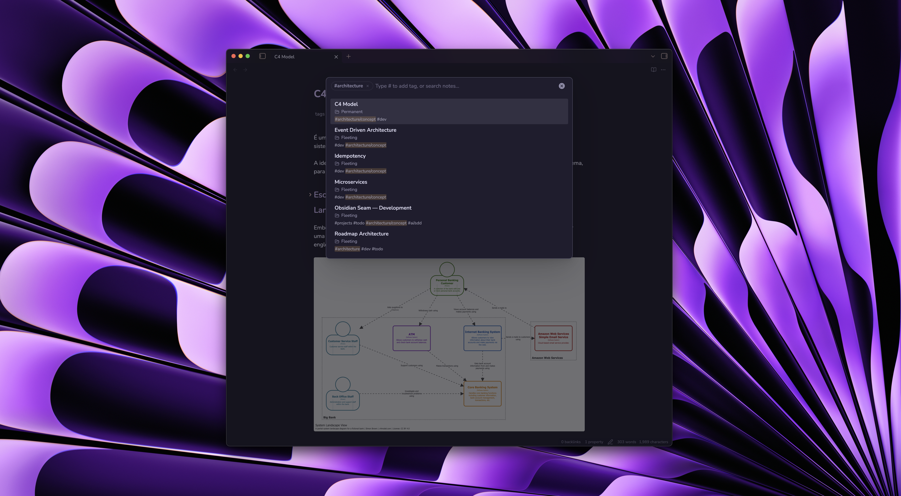

# Seam — Frictionless Note Organization for Obsidian

> Capture thoughts, tag naturally, and let Seam organize your vault quietly in the background.

Seam is a lightweight, native-feeling Obsidian plugin designed to eliminate organization friction. Instead of manually dragging notes into deep folder trees or managing complex productivity systems, Seam lets you focus on writing.

Use simple tags like `#permanent` and `#archive` to file notes automatically, search across your entire vault with live tag chips and in-content text search, and keep your workspace effortlessly decluttered.



## Why Seam?

Most note-taking systems slow you down with organization overhead: *Where should this note live? Which folder? Did I remember to archive that old project?*

Seam introduces a quiet, tag-driven philosophy:

| Traditional Workflow | With Seam |
|:---|:---|
| ❌ Manually dragging files into folders | ✅ Just add `#permanent` — filed automatically |
| ❌ Cluttered workspaces filled with stale notes | ✅ Just add `#archive` — safely archived and tagged `#archived` |
| ❌ Switching between multiple search tools | ✅ One **Universal Palette** for notes, content, tags, and commands |
| ❌ Rigid folder hierarchies | ✅ Flexible, tag-driven workflow with clean folder backing |
| ❌ Desktop-only features or sluggish plugins | ✅ 100% native Obsidian APIs, instant and fully mobile-friendly |

## How Seam Fits into Your Workflow

Integrating Seam into your daily routine is simple and intuitive:

### 1. Capture Without Friction (Fleeting Notes)
Whenever inspiration strikes, open the **Universal Palette** (`Cmd/Ctrl + Shift + P` or configured hotkey) and type a note title. If the note doesn't exist yet, hit Enter to create it instantly in your `Fleeting/` folder. You can even configure a custom template with your preferred frontmatter or headings.

```
Universal Palette → "Meeting with Design Team" → [Create new note]
```


### 2. File Permanent Notes (`#permanent`)
When a thought is developed and ready to be kept forever, simply add `#permanent` to the note (inline or in frontmatter).

Seam will:
1. Move the note to your `Permanent/` folder.
2. Remove the temporary `#permanent` tag.
3. Automatically clean up scratch tags (like `#todo` or `status` properties) based on your preferences.

### 3. Archive Completed Work (`#archive`)
Done with a project, task, or meeting note? Add `#archive`:
1. The note moves to your `Archive/` folder.
2. The `#archive` action tag is removed.
3. A durable `#archived` state tag is added so you can still find it later.


### 4. Search and Filter with Live Tag Chips
Press your hotkey to open the **Universal Palette**:
- **Search Notes & Content**: Type any word to search note titles and body text with highlighted snippets.
- **Search by Tags**: Type `#` to view all vault tags. Type `#ai` to filter tags, and press Enter to select.
- **Combine Filters**: Selected tags become chips (`#ai×` `#machine_learning×`). You can combine multiple tags, remove them with `Backspace` or clicking `×`, and filter notes across your entire vault.
- **Open in New Tab**: Press `Cmd + Enter` (Mac) or `Ctrl + Enter` (Windows/Linux) to open any result in a new tab without losing your current view.


## Key Features

### Hands-Off Tag Routing
No need to drag and drop files. Seam watches for action tags and routes your notes safely:
- `#permanent` → Moves to `Permanent/` and cleans up action tags.
- `#archive` → Moves to `Archive/`, removes `#archive`, and marks durable state `#archived`.
- **Conflict Safe**: If a note accidentally has both `#archive` and `#permanent`, Seam leaves it untouched to prevent mistakes.

### Universal Palette
A single floating search modal that does it all:
- **In-Note Content Search**: Finds matches inside note body text and displays contextual preview snippets with highlighted terms.
- **Interactive Tag Filtering**: Type `#` to browse tags, press Enter to add tag chips, and narrow down matching notes in real time.
- **Instant Note Creation**: Quickly create a new fleeting note if no existing note matches your query.
- **Open in New Tab**: Native shortcut support (`Cmd+Enter` / `Ctrl+Enter`).
- **Seam Commands**: Type `>` to quickly run Seam automation commands.

### Automatic Cleanup on Move
Keep notes clean when moving them between stages. You can customize which tags (e.g. `#todo`, `#review`) or frontmatter properties (e.g. `status`) are automatically cleared when a note is archived or made permanent.

### Fleeting Note Templates
Point Seam to any template note in your vault (e.g., `Templates/Fleeting Note`). New notes created via the palette will automatically start with your template's layout, checklists, or metadata.

### First-Class Mobile Support
Seam is built exclusively with Obsidian's public native APIs. No external dependencies, no desktop-only code — everything works smoothly on iPhone, iPad, and Android.

## Settings


Customize Seam under **Settings → Community Plugins → Seam**:

- **Folders**: Set your preferred paths for `Fleeting/`, `Permanent/`, and `Archive/` folders.
- **Fleeting Template**: Set a path to a template note used when creating notes from the palette.
- **Action Tags**: Customize the tag names for archiving (`archive`), filing (`permanent`), and archive state (`archived`).
- **Automation**: Toggle background automation and configure periodic reconciliation intervals.
- **Moving Notes Behavior**: Choose whether to strip scratch tags (`#todo`, `#permanent`) and frontmatter properties (`status`) when moving notes.
- **Universal Palette**: Toggle icons in search results and commands.

## Installation

### From Obsidian Community Plugins

1. Open **Settings → Community plugins** in Obsidian.
2. Turn off *Restricted mode*.
3. Click **Browse** and search for **Seam**.
4. Click **Install**, then **Enable**.

### Manual Installation

1. Download the latest release (`main.js`, `manifest.json`, `styles.css`) from the [Releases](https://github.com/WillACosta/obsidian-seam/releases) page.
2. Create a folder named `obsidian-seam` inside your vault's plugin directory: `<vault>/.obsidian/plugins/obsidian-seam/`.
3. Copy the downloaded files into that folder.
4. Reload Obsidian and enable **Seam** under **Settings → Community plugins**.

## Keyboard Shortcuts & Commands

| Command | Palette Syntax / Action | Description |
|:---|:---|:---|
| **Open Universal Palette** | Open modal | Universal search for notes, tags, content, and commands |
| **Open in New Tab** | `Cmd + Enter` / `Ctrl + Enter` | Open the selected note suggestion in a new editor tab |
| **Filter by Tag** | `#<tag>` | Search and filter notes by tag with interactive chips |
| **Command Mode** | `>` | Browse and trigger Seam commands directly |
| **Archive current note** | Command palette | Archives the currently open markdown note |
| **Move to Permanent** | Command palette | Moves the currently open markdown note to Permanent |
| **Archive all notes** | Command palette | Processes all notes in the vault tagged with `#archive` |

## Support the Project

Seam is free, open-source software built with passion. If Seam saves you time and makes your Obsidian vault a calmer place to think, consider supporting its continued development!

Support ongoing development and future iterations:

[](https://buymeacoffee.com/willacosta)

**Pix**<br>


## License

This project is licensed under the [MIT License](LICENSE).

## Built with

Seam was built with the help of AI agents. Every iteration (phase-by-phase build) was tracked as plain spec-files, written by me.

Crafted with care by **William A. Costa** ([@WillACosta](https://github.com/WillACosta)).
