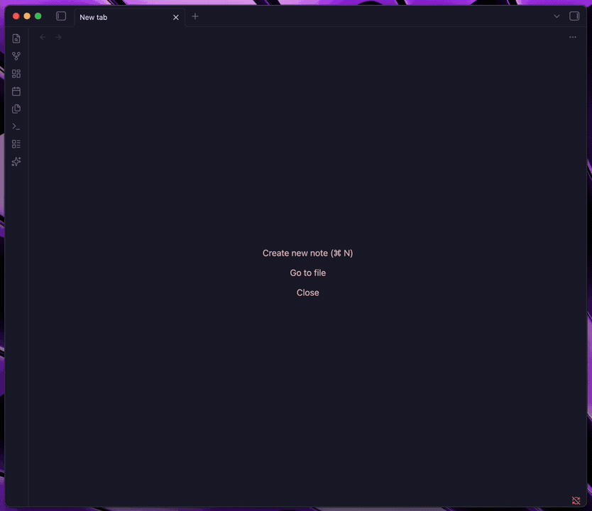
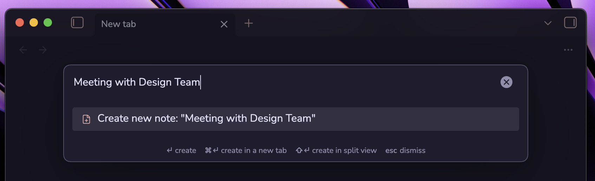
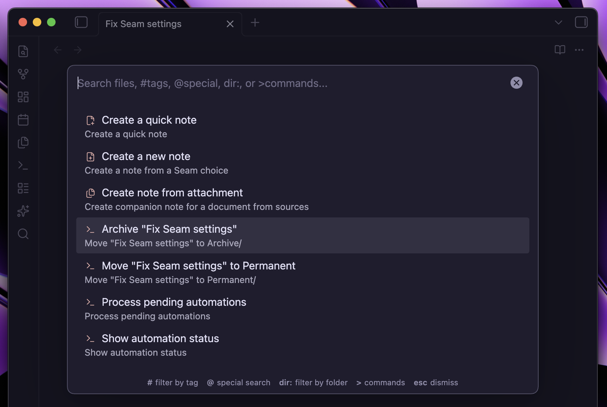
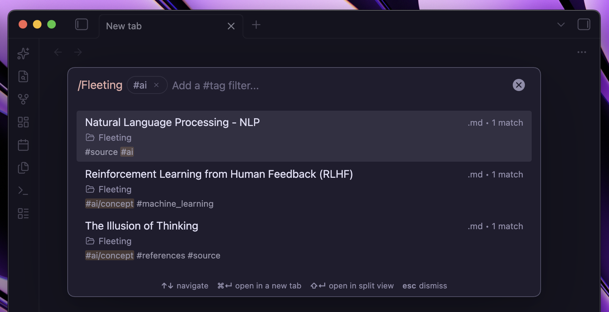
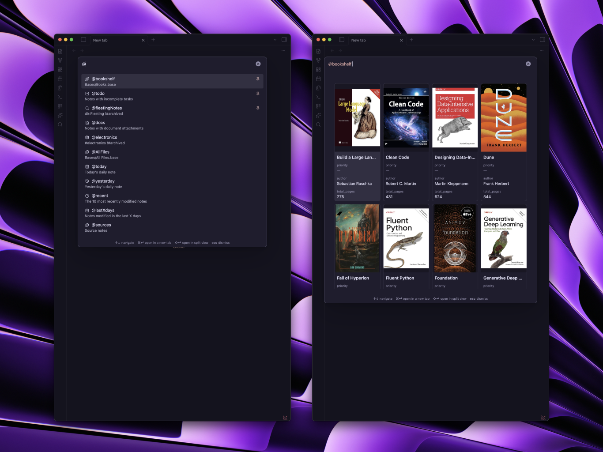
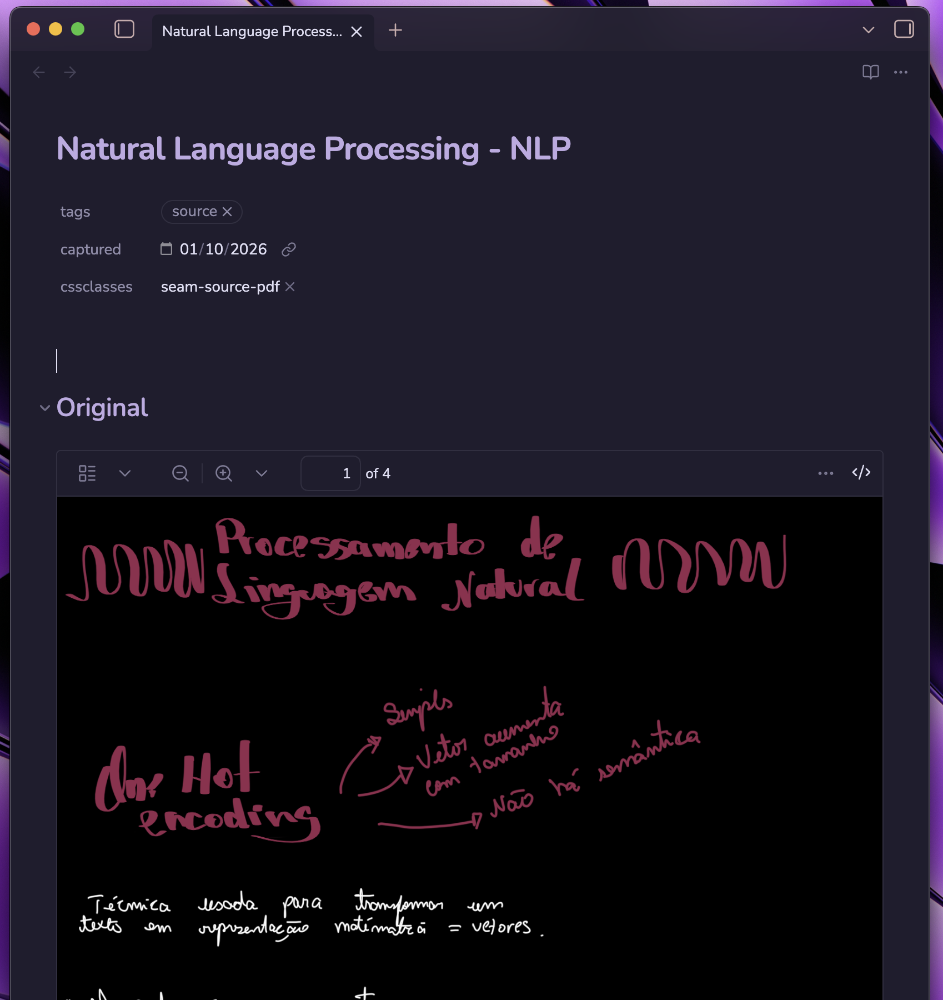
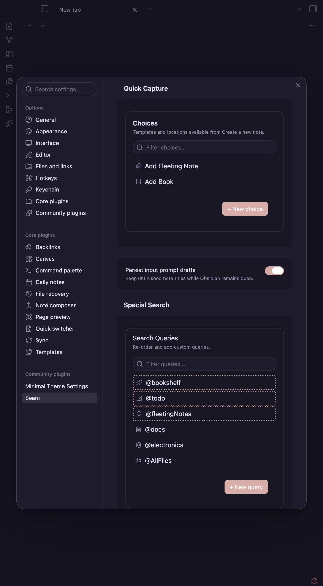

# Seam — Frictionless Note Organization for Obsidian

> **English** · [Português](README.pt-br.md)

> Capture thoughts, tag naturally, and let Seam organize your vault quietly in the background.

Seam is a lightweight Obsidian plugin that organizes notes through tags. Inspired by the [Zettelkasten](https://zettelkasten.de/introduction/) method and apps like Apple Notes and Bear, it uses a simple workflow built around `Fleeting`, `Permanent`, and `Archive`. Add `#permanent` or `#archive` to move a note, and use the Universal Palette to search your vault. Spend less time managing files and more time writing.



## Why Seam?

Seam keeps organization simple and stays out of your way:

| Traditional Workflow | With Seam |
|:---|:---|
| ❌ Move files between folders by hand | ✅ Add `#permanent` to file a note automatically |
| ❌ Leave completed notes mixed with active work | ✅ Add `#archive` to move them out of the way |
| ❌ Switch between different search tools | ✅ Search notes, content, tags, and commands in one palette |
| ❌ Use separate tools for search, quick capture, and source notes | ✅ Explore Special Search, create notes with Quick Capture, and keep Source notes linked from the same workflow |
| ❌ Maintain a deep folder hierarchy | ✅ Use a simple workflow guided by tags |
| ❌ Depend on desktop-only features | ✅ Use Seam on desktop and mobile |

## How Seam Fits into Your Workflow

### 1. Capture Without Friction (Fleeting Notes)

Open the **Universal Palette** from the command palette or with your chosen shortcut, then type a note title. If the note does not exist, press `Enter` to create it in `Fleeting/`. You can also use a template for your preferred properties and headings.

```
Universal Palette → "Meeting with Design Team" → [Create new note]
```


### 2. File Permanent Notes (`#permanent`)

When a note is ready to keep, add `#permanent` in the note body or properties.

Seam will:

1. Move the note to your `Permanent/` folder.
2. Remove the `#permanent` action tag.
3. Remove any additional tags or properties you chose in settings.

### 3. Archive Completed Work (`#archive`)

When a project, task, or meeting note is complete, add `#archive`.

1. The note moves to your `Archive/` folder.
2. Seam removes the `#archive` action tag.
3. Seam can add `#archived` so the note remains easy to find.



### 4. Search and Filter with Live Tag Chips

Open the **Universal Palette**:

- **Search notes and content**: Find matches in titles, paths, and note text.
- **Filter by tag**: Type `#` to browse tags, then press `Enter` to add one.
- **Combine filters**: Add multiple tag chips and remove them with `Backspace` or `×`.
- **Open in a new tab**: Press `Cmd + Enter` on macOS or `Ctrl + Enter` on Windows and Linux.



## Key Features

### Hands-Off Tag Routing

Seam reads action tags from the note body or properties. It creates destination folders when needed, avoids overwriting files, and removes action tags only after a successful move. If a note has both `#permanent` and `#archive`, Seam leaves it in place.

### Universal Palette

Search and act from one place:

- Find notes by title, path, tag, or content.
- Preview matching text before opening a note.
- Create a fleeting note when no result matches.
- Type `>` to run Seam commands.

### Custom Search

Keep your favorite searches one step away. Create shortcuts for projects, reading lists, or any collection of notes, and pin them in the Universal Palette. Choose how each query finds notes:

- **Seam search system**: Combine tags, directory filters, and text search in a reusable query.
- **Bases**: Use a Base and its views to explore results as tables or cards in the Universal Palette.



### Automatic Cleanup on Move

Choose which temporary tags and note properties Seam removes after a successful move. For example, you can clear `#todo`, `#review`, or a `status` property.

### Fleeting Note Templates

Choose a template note, such as `Templates/Fleeting Note`. New notes created from the palette will start with its content and properties.

### Source Notes

Bring handwritten notes, documents, and images into your workflow. Export them to `Sources/`, and Seam creates a note linked to the original.

Find your sources with `@sources` in the Universal Palette and read PDFs with continuous pages.



### First-Class Mobile Support

Seam uses Obsidian's public APIs and no desktop-only code. It works on desktop, iPhone, iPad, and Android.

## Settings



Customize Seam under **Settings → Community Plugins → Seam**.

## Installation

### From Obsidian Community Plugins

1. Open **Settings → Community plugins** in Obsidian.
2. Turn off **Restricted mode** if needed.
3. Click **Browse** and search for **Seam**.
4. Click **Install**, then **Enable**.

### Manual Installation

1. Download the latest release (`main.js`, `manifest.json`, `styles.css`) from the [Releases](https://github.com/WillACosta/obsidian-seam/releases) page.
2. Create a folder named `obsidian-seam` inside your vault's plugin directory: `<vault>/.obsidian/plugins/obsidian-seam/`.
3. Copy the downloaded files into that folder.
4. Reload Obsidian and enable **Seam** under **Settings → Community plugins**.

## Seam Filtering Syntax

Use these tokens in the Universal Palette to narrow a search or switch modes:

| Token | What it does | Example |
|:---|:---|:---|
| `#tag` | Filter notes by tag. | `#reading` |
| `!#tag` or `-#tag` | Exclude notes with a tag. | `!#archived` |
| `/` | Filter notes by directory. Put paths with spaces in quotes. | `/Fleeting` · `/"Project Archive"` |
| `@` | Run a built-in or custom Special Search. | `@today` · `@sources` · `@books` |
| `OR` or `||` | Match either side of a search. | `#reading OR #research` |
| `>` | Browse and run Seam commands. | `>archive` |

## Languages

Seam follows Obsidian's language setting. It currently supports:

- **English (US)**
- **Portuguese (BR)**

Other languages use English by defaultCombined search.

### Contributing Translations

Want to use Seam in another language? Contributions are welcome:

1. Create a new locale file in `src/i18n/locales/<locale-code>.ts` (e.g., `es.ts`, `fr.ts`, `de.ts`) implementing the `Translations` type.
2. Register the new locale in `src/i18n/index.ts`.
3. Open a Pull Request on [GitHub](https://github.com/WillACosta/obsidian-seam).

## Support the Project

Seam is free and open source. If it saves you time, consider supporting its development:

[](https://ko-fi.com/acostawill)

**Pix**<br>


## Development

For developer instructions, Spec-Driven Development (SDD) guidelines, and release procedures, see [README.dev.md](README.dev.md).

## License

This project is licensed under the [GNU General Public License v3.0](LICENSE).

## Built with

Seam was built with the help of AI agents. Each iteration was guided and documented with plain-text specifications written by me.

Crafted with care by **William A. Costa** ([@WillACosta](https://github.com/WillACosta)).
