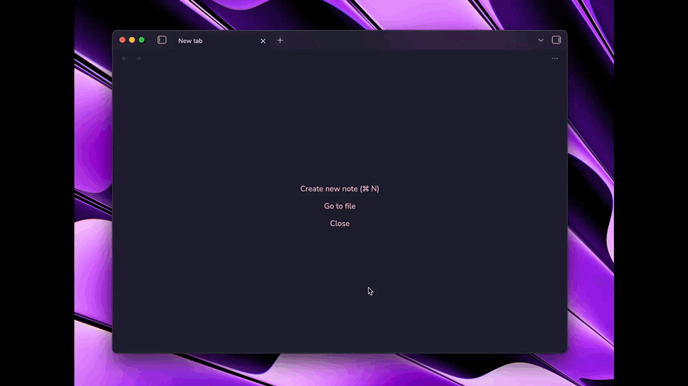
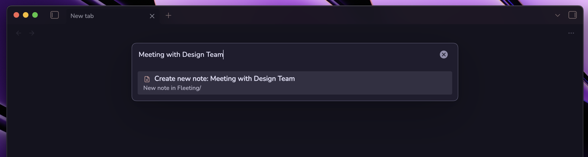
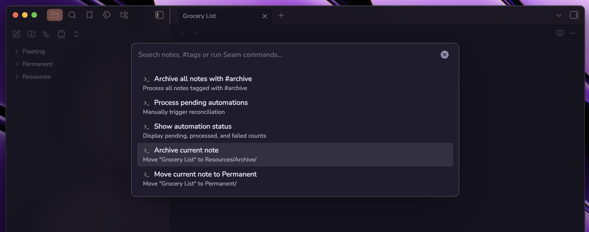
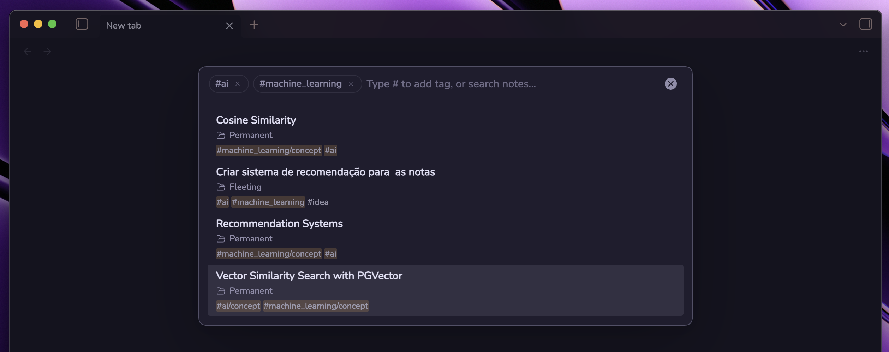
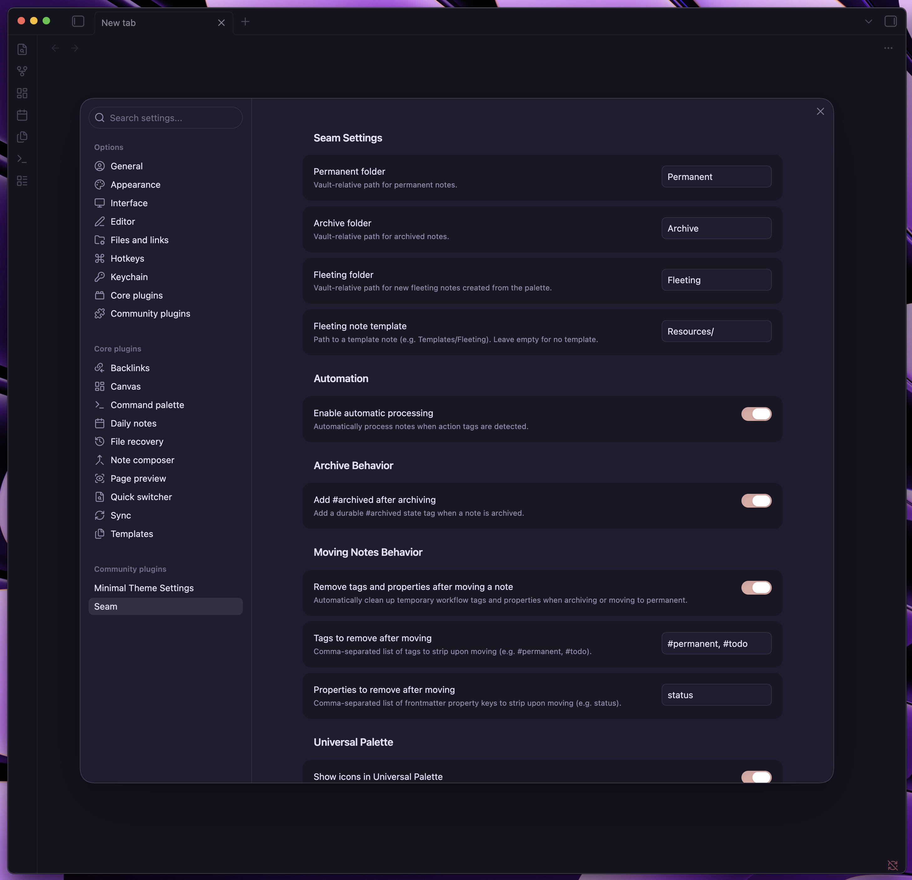

# Seam — Organização de Notas sem Fricção para o Obsidian

> [English](README.md) · **Português**

> Capture pensamentos, adicione tags naturalmente e deixe o Seam organizar suas notas silenciosamente em segundo plano.

Seam é um plugin leve e com comportamento nativo para o Obsidian, pensado para eliminar o atrito com a organização. Em vez de mover notas manualmente entre diretórios complexos e gerenciar todo o processo de organização, Seam faz isso por você, permitindo que você foque no que realmente importa: **a escrita**.

Use tags simples como `#permanent` e `#archive` para arquivar notas automaticamente, faça pesquisas completas por todo o Vault com busca por tags e pesquisa interna nas notas, mantendo seu espaço de trabalho extremamente organizado.



## Por que o Seam?

A maioria dos sistemas de anotações sobrecarrega você com burocracia de organização: *Onde essa nota deve ficar? Em qual pasta? Lembrei de arquivar aquele projeto antigo?*

Seam introduz uma filosofia silenciosa orientada a tags:

| Fluxo Tradicional | Com o Seam |
|:---|:---|
| ❌ Arrastar arquivos manualmente para pastas | ✅ Basta adicionar `#permanent` — organizado automaticamente |
| ❌ Cofre poluído com notas antigas e esquecidas | ✅ Basta adicionar `#archive` — arquivado com segurança e marcado como `#archived` |
| ❌ Alternar entre múltiplas ferramentas de busca | ✅ Uma única **Paleta Universal** para notas, conteúdo, tags e comandos |
| ❌ Hierarquias rígidas de pastas | ✅ Fluxo de trabalho flexível guiado por tags com pastas limpas de apoio |
| ❌ Recursos apenas para desktop ou plugins pesados | ✅ APIs 100% nativas do Obsidian, instantâneo e totalmente compatível com dispositivos móveis |

## Como o Seam se integra à sua rotina

Integrar o Seam ao seu dia a dia é simples e intuitivo:

### 1. Capture sem Fricção (Notas Efêmeras / Fleeting)

Sempre que uma ideia surgir, abra a **Paleta Universal** (`Cmd + K` no Mac, `Ctrl + K` no Windows/Linux, ou seu atalho configurado) e digite o título da nota. Se a nota ainda não existir, pressione Enter para criá-la no diretório de `Fleeting/`. Você também pode configurar um template com suas propriedades ou cabeçalhos favoritos.

```
Paleta Universal → "Reunião com Equipe de Design" → [Criar nova nota]
```


### 2. Salve Notas Permanentes (`#permanent`)

Quando um pensamento estiver maduro e pronto para ser armazenado definitivamente, basta adicionar `#permanent` à nota (no texto ou no frontmatter).

O Seam irá:

1. Mover a nota para sua pasta `Permanent/`.
2. Remover a tag temporária `#permanent`.
3. Remover automaticamente tags de rascunho (como `#todo` ou a propriedade `status`), de acordo com suas configurações.

### 3. Arquive Trabalhos Concluídos (`#archive`)

Terminou um projeto, tarefa ou reunião? Adicione `#archive`:

1. A nota é movida para a pasta `Archive/`.
2. A tag de ação `#archive` é removida.
3. Uma tag de estado permanente `#archived` é adicionada para que você possa encontrá-la facilmente depois.



### 4. Busque e Filtre com tags dinâmicas

Pressione seu atalho para abrir a **Paleta Universal**:

- **Buscar Notas e Conteúdo**: Digite qualquer palavra para buscar títulos e o conteúdo das notas.
- **Buscar por Tags**: Digite `#` para ver todas as tags disponíveis. Digite `#ia` para filtrar tags e pressione Enter para selecionar.
- **Combinar Filtros**: As tags selecionadas viram chips (`#ia×` `#machine_learning×`). Você pode combinar várias tags, removê-las com `Backspace` ou clicando no `×`, e filtrar os resultados.
- **Abrir em Nova Aba**: Pressione `Cmd + Enter` (Mac) ou `Ctrl + Enter` (Windows/Linux) para abrir qualquer resultado em uma nova aba sem perder sua visualização atual.



## Principais Funcionalidades

### Roteamento Automático por Tags

Sem necessidade de arrastar e soltar arquivos. O Seam monitora as tags de ação e move suas notas com total segurança:
- `#permanent` → Move para `Permanent/` e limpa tags de ação.
- `#archive` → Move para `Archive/`, remove `#archive` e adiciona o estado durável `#archived`.
- **Prevenção de Conflitos**: Se uma nota tiver acidentalmente ambas as tags `#archive` e `#permanent`, o Seam não a move, evitando erros.

### Paleta Universal

Uma janela flutuante única de busca que faz de tudo:
- **Busca no Conteúdo da Nota**: Localiza correspondências no corpo das notas e exibe uma prévia contextual com os termos destacados.
- **Filtragem Interativa de Tags**: Digite `#` para navegar pelas tags, pressione Enter para fixar chips de tags e refinar as notas em tempo real.
- **Criação Instantânea de Notas**: Crie uma nova nota efêmera rapidamente caso nenhuma nota existente corresponda à sua busca.
- **Abrir em Nova Aba**: Suporte a atalhos nativos (`Cmd+Enter` / `Ctrl+Enter`).
- **Comandos do Seam**: Digite `>` para executar comandos de automação do Seam diretamente.

### Limpeza Automática ao Mover

Mantenha suas notas organizadas ao movê-las entre fases. Você pode personalizar quais tags (ex: `#todo`, `#review`) ou propriedades de frontmatter (ex: `status`) serão limpas automaticamente quando uma nota for arquivada ou tornada permanente.

### Defina uma template para as notas efêmeras (Fleeting)

Defina um template (ex: `Templates/Nota Efêmera`). Novas notas criadas pela paleta usarão este template por padrão.

### Compatibilidade Total com Dispositivos Móveis

Seam foi desenvolvido exclusivamente com as APIs públicas e nativas do Obsidian. Sem dependências externas, sem código exclusivo para desktop, tudo funciona perfeitamente no iPhone, iPad e Android.

## Configurações



Personalize o Seam em **Configurações → Plugins da comunidade → Seam**:

- **Pastas**: Defina seus caminhos preferidos para as pastas `Fleeting/`, `Permanent/` e `Archive/`.
- **Modelo de Nota Efêmera**: Configure o caminho de uma nota modelo usada ao criar notas pela paleta.
- **Tags de Ação**: Personalize os nomes das tags para arquivamento (`archive`), permanente (`permanent`) e estado arquivado (`archived`).
- **Automação**: Ative/desative o processamento em segundo plano e ajuste os intervalos de reconciliação periódica.
- **Comportamento ao Mover Notas**: Escolha se deseja remover tags temporárias (`#todo`, `#permanent`) e propriedades de frontmatter (`status`) ao mover notas.
- **Paleta Universal**: Configure o atalho de teclado para abrir a paleta (padrão: `Cmd + K` no Mac, `Ctrl + K` no Windows/Linux) e ative ou desative os ícones nos resultados de busca e comandos.

## Instalação

### Pelos Plugins da Comunidade do Obsidian

1. Abra **Configurações → Plugins da comunidade** no Obsidian.
2. Desative o *Modo restrito*.
3. Clique em **Explorar** e procure por **Seam**.
4. Clique em **Instalar** e depois em **Ativar**.

### Instalação Manual

1. Baixe o release mais recente (`main.js`, `manifest.json`, `styles.css`) na página de [Releases](https://github.com/WillACosta/obsidian-seam/releases).
2. Crie uma pasta chamada `obsidian-seam` no diretório de plugins do seu cofre: `<cofre>/.obsidian/plugins/obsidian-seam/`.
3. Copie os arquivos baixados para dentro dessa pasta.
4. Recarregue o Obsidian e ative o **Seam** em **Configurações → Plugins da comunidade**.

## Atalhos de Teclado e Comandos

| Comando | Atalho / Ação | Descrição |
|:---|:---|:---|
| **Abrir Paleta Universal** | `Cmd + K` / `Ctrl + K` (configurável) | Busca universal por notas, tags, conteúdo e comandos |
| **Abrir em Nova Aba** | `Cmd + Enter` / `Ctrl + Enter` | Abre a nota selecionada em uma nova aba do editor |
| **Filtrar por Tag** | `#<tag>` | Busca e filtra notas por tag com chips interativos |
| **Modo de Comandos** | `>` | Navega e executa comandos do Seam diretamente |
| **Arquivar nota atual** | Paleta de comandos | Arquiva a nota markdown aberta no momento |
| **Mover para Permanente** | Paleta de comandos | Move a nota markdown aberta no momento para Permanente |
| **Arquivar todas as notas** | Paleta de comandos | Processa todas as notas no cofre marcadas com `#archive` |

## Internacionalização (i18n)

O Seam detecta o idioma configurado no seu Obsidian e adapta automaticamente sua interface:

- **Inglês (US)**
- **Português (BR)**

Se um idioma não suportado estiver selecionado no Obsidian, o Seam utiliza o inglês como padrão.

### Como Contribuir com Traduções

Gostaria de ver o Seam no seu idioma nativo? Novas contribuições são muito bem-vindas:

1. Crie um novo arquivo de idioma em `src/i18n/locales/<código-do-idioma>.ts` (ex: `es.ts`, `fr.ts`, `de.ts`) implementando a interface `Translations`.
2. Registre o novo idioma em `src/i18n/index.ts`.
3. Abra um Pull Request no [GitHub](https://github.com/WillACosta/obsidian-seam).

## Apoie o Projeto

O Seam é um software gratuito e de código aberto desenvolvido com dedicação. Se o plugin economiza seu tempo e torna sua vida no Obsidian um lugar mais tranquilo para usar e pensar, considere apoiar me apoiar através de uma das opções abaixo:

Apoie o desenvolvimento e futuras iterações:

[](https://buymeacoffee.com/willac)

**Pix**<br>


## Licença

Este projeto está sob a licença [GNU General Public License v3.0](LICENSE).

## Como foi construído

Seam foi desenvolvido com o auxílio de agentes de IA. Cada iteração foi documentada e guiada por arquivos de especificação escritos por mim.

Desenvolvido com cuidado por **William A. Costa** ([@WillACosta](https://github.com/WillACosta)).
