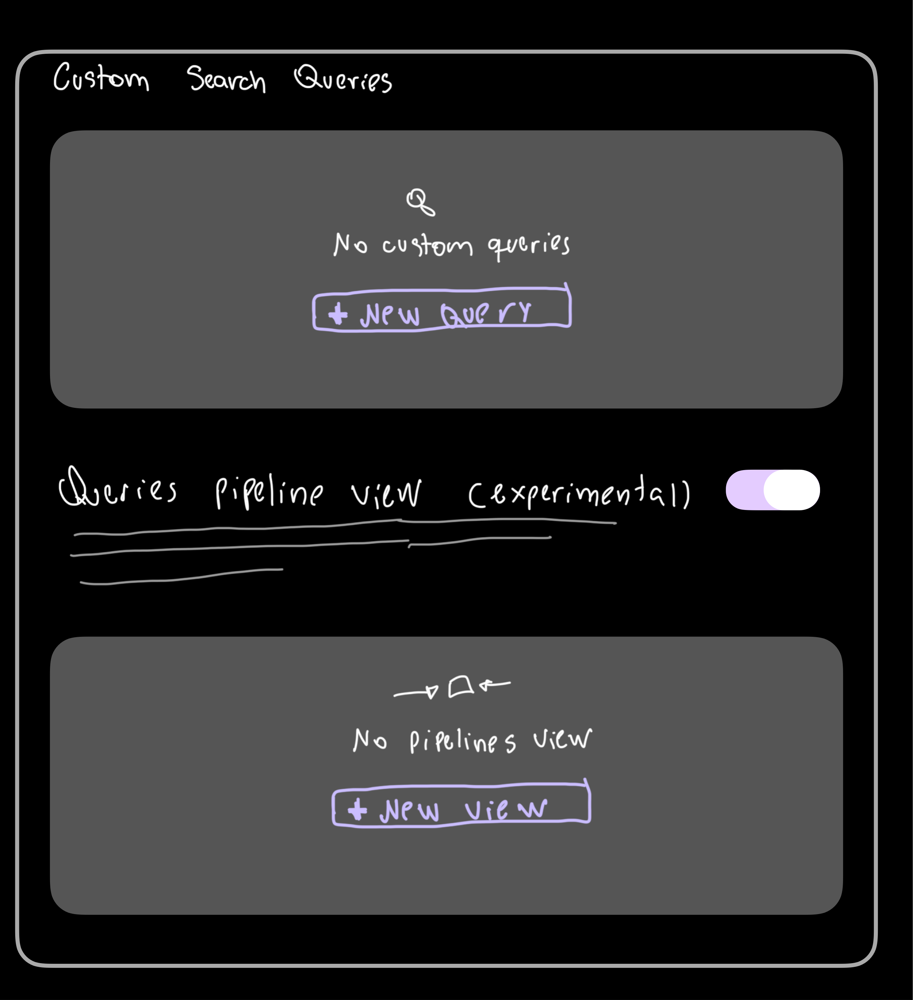
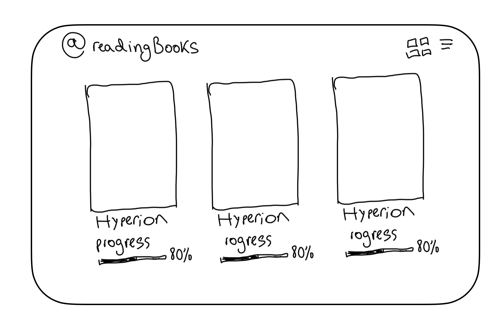
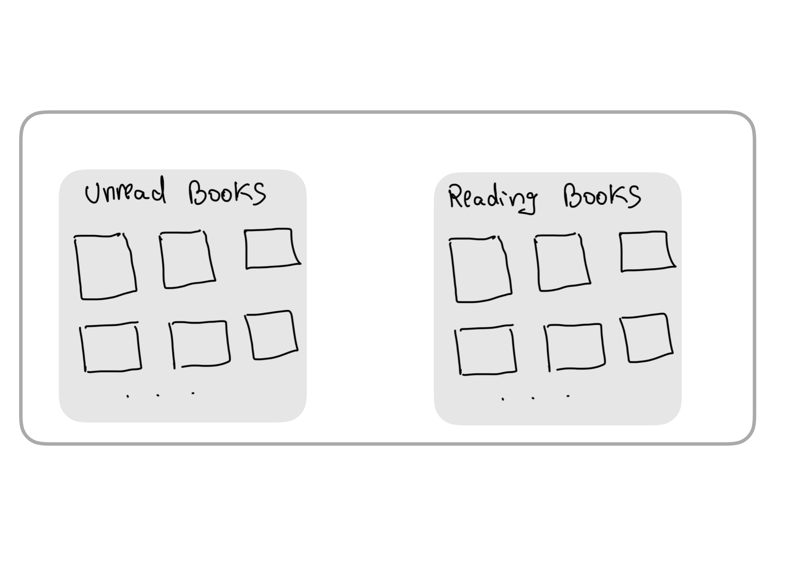
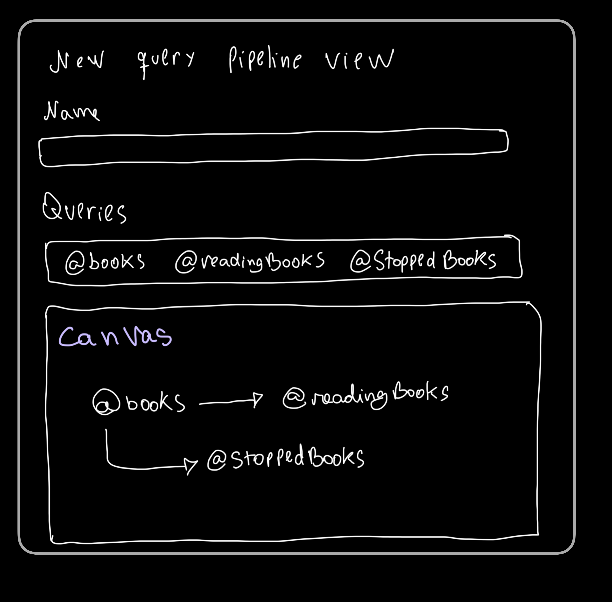

> **General Rules**:
> - Modularize the code where needed; do not duplicate code that already exists in other parts of the codebase.
> - All text inputs should fill 100% of the modal width.
> - Remember that all features should also work on mobile

# Add support for custom "Special Search"

Add a new section in the Seam settings tab to enable users to create their own special search queries; we can use the same UI group list as in the "Quick Add" settings section.

Universal Palette demo with custom queries:

```
--------------------------------------------------------------
| ...
| @posts
| @readingBooks
| @bookLibrary
--------------------------------------------------------------
```



> Wireframe of the UI for the "Custom Search Queries" feature

This feature is divided into two scenarios: "Custom search queries" and "Query pipeline view".

## New custom search query settings (modal)

```
Identifier
Filtering Mode         -> select (Bases, Seam tags)
```

1. When 'Bases' is selected:

```
Base file -> Text input with suggestions (`.base` files only)
Base view -> Text input with suggestions (look for the current base file)
Show Base menu bar -> Boolean (false by default)
```

If you need more information about Obsidian Bases, head to the official docs (https://obsidian.md/help/bases).

2. When `Seam tags` is selected:

```
Tag filter   -> Text input with suggestions (Available tags; the same behavior as in the Universal Palette tags search)
```

For the input with tag suggestions, we should modularize the code, as the behavior is the same as used in the Seam's Universal Palette.

## UI behavior

### Custom Search Query Item (Listing UI)

The UI for each added custom query is the same UI as used in the "Quick Add" listing item, with the following icon buttons:

```
edit
duplicate
pin
hide
delete
reorder
```

Look for the existing implementation on the "Quick Add" choices listing, and modularize code when needed.

### Queries color

We should add a differentiation between Seam's built-in queries and the ones defined by the user (custom queries).

### Rendering Bases view

When a `.base` file is tied to a custom query, we will render its content inside Seam's Universal Palette. For example, in the `@readingBooks` query, users may want to display book metadata alongside an image of it:



> The above image is a raw wireframe of the UI; we'll render the content inside the modal.

## Query pipeline view (experimental)

> We should add a temporary option to enable this feature, as it's experimental

Here we want to explore a visual feature for the notes pipelines; the idea is to "link" custom search queries (`@`) by creating a visual pipeline for them.

When selecting a pre-defined pipeline view in the Universal Palette, e.g., `@bookLibrary`, we'll expand the modal and render the content accordingly with the defined config for that pipeline; see an wireframe as an example:



In the above wireframe, we connect two separate views, @unreadBooks and @readingBooks. When choosing the `@bookLibrary` pipeline, we render the complete pipeline process; note the arrow between them.

This would enable a new option in the "Custom Search Queries" settings tab:

```
Custom Search Queries
...

Queries Pipeline
"Visualize individual queries as connected pipelines"
```

For the pipeline config, we want to enable these options:

- Pipeline name (will be used to invoke it, e.g., `@booksLibrary`)
- Queries for the pipeline (input text with suggestions - chip-like)
- Canvas for arranging queries and directions.
### Implementation of "New Pipeline" config modal

- Text input fields should fill 100% of the available space, with the title on top of it (column).
- Queries should be a chip selector; when typing into the text field, we will suggest all current queries (custom and built-in).
- Users can select a query from the suggestion list.

The selected queries will be appended to the canvas, so users can create the connections between them and orient Seam on how to display their content in the Universal Palette view.

**Canvas for arrangement**:

Implement a Canvas-Like organization for the pipelines view; we'll enable a canvas so queries can be arranged in any direction with the desired arrow connections. See the wireframe below:



The canvas works as a visual helper for users; the important aspect for Seam is how each query is connected and the direction. We'll use the Canvas arrangement as the logical placement for the embedded views.

For example, the connections found in the above wireframe are:

```
@books -> @readingBooks
@books -> @stoppedBooks
```
