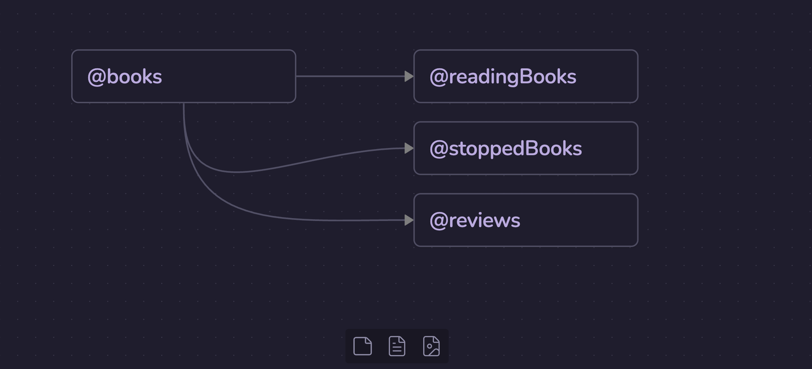
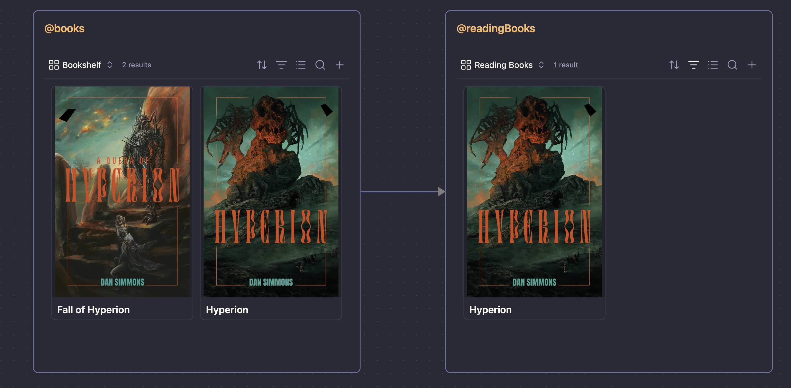

## Fixes

### **Custom Search Queries - Listing UI**

- Set a limit of 5 items before activating `overflow-y` for the listing, so we can prevent it from growing too large — Add this behavior to the "Quick Add" listing UI too.

### **Pipeline View**

- Bug: The components are inverted; the text label should be first, then the toggle button.
- Update the text for:

"Pipeline View (Experimental)"
"Enable pipeline view for custom queries"

- When set to true, we will enable a new button at the side of "New query" with "New Pipeline".
- When adding a new "pipeline view" item, it behaves the same way regarding the "Custom Search Queries" UI listing (edit, duplicate, pin, hide, delete, and drag).
- For these items, add a different icon for them in the listing (choose the best one).

**New/Edit query pipeline (Modal)**:

- All text fields should be rendered in a "Flex Column" style, with text labels on top and inputs below.
- Remove the "Direction" select field — Direction will be defined in the canvas.
- For the Canvas, we should use a library for it; it would be something like this when relations are defined:

The Canvas implementation should use the official Canvas API from Obsidian, the JSON Canvas library (https://jsoncanvas.org/), and look for the official Obsidian dev docs if needed.

### **Custom Searches UI in Universal Palette**:

**For Bases queries**:

- Remove the name of the custom query from the rendering view; it's already visible in the text input
- The base view menu is not being hidden when "Hide Base's menu" is enabled.
- Close the Universal Palette modal when clicking on a listing item; The "`command`/`ctrl` + click" shortcut should also be supported to open the note in a new tab.
- Remove the "navigate" and "enter" helper text, as in the Bases rendering we are not able to interact with results using keyboard shortcuts.

**For Pipeline Views**:

- Pipeline views shouldn't render their content before being selected from the suggestions.
- When rendering the pipeline view, we will use the Obsidian Canvas to draw each view and its connections, for example:

> Note that it is the same UI as the native canvas; we're just rendering them in the predefined order (a visual pipeline).

