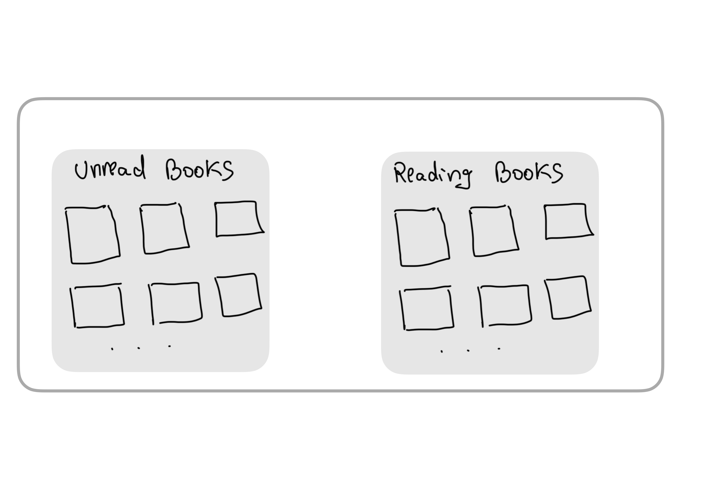
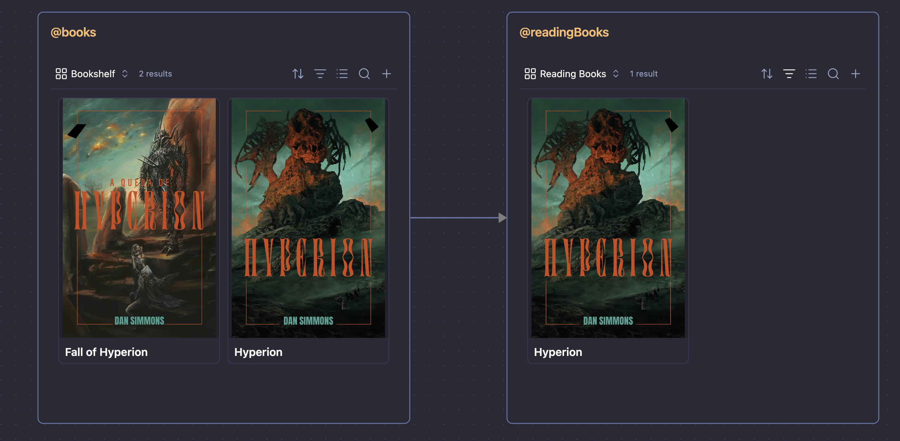

### **Edit/New query pipeline (Modal)**:

1. Refactor the "Queries" selection: the chip components should be placed inside the input is the same UI style as used in the Universal Palette tags search.
2. Pipeline Canvas:

- You should analyze the possibility of implementing the Obsidian built-in Canvas feature, using JSON-Canvas (https://jsoncanvas.org/).

```
Query Pipeline View

View Name
________________________________________

Queries
________________________________________

Pipeline Canvas

----------------------------------------
|                                      |
|  @allBooks     ->   @readingBooks    |
|                                      |
----------------------------------------
```

When selecting a new query, they are added to the canvas so users can link it to create the pipeline and reorder them.

- Remove the "Add Connection" options, as they're unnecessary.

### Query pipeline UI in Universal Palette

The pipeline should be rendered with the same structure they are were planned in the settings canvas, e.g.:

```
@allBooks (component block)------>@readingBooks (component block)
```

** Component block means the group of notes or the correspondent bases file that will be rendered.

## Images you need to analyze and understand the UI/UX behavior

Pipeline Wireframe UI:


Demo Pipeline UI:

